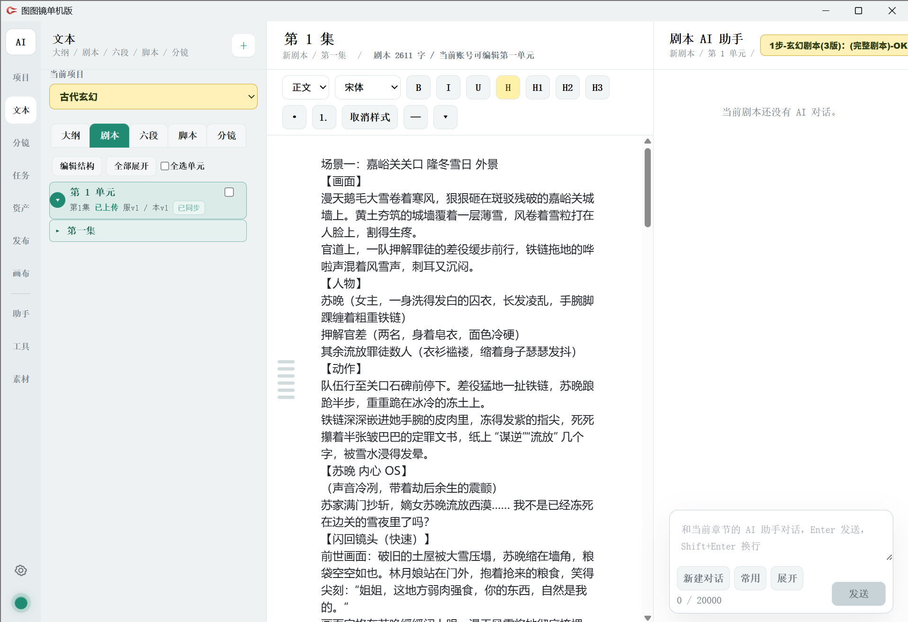
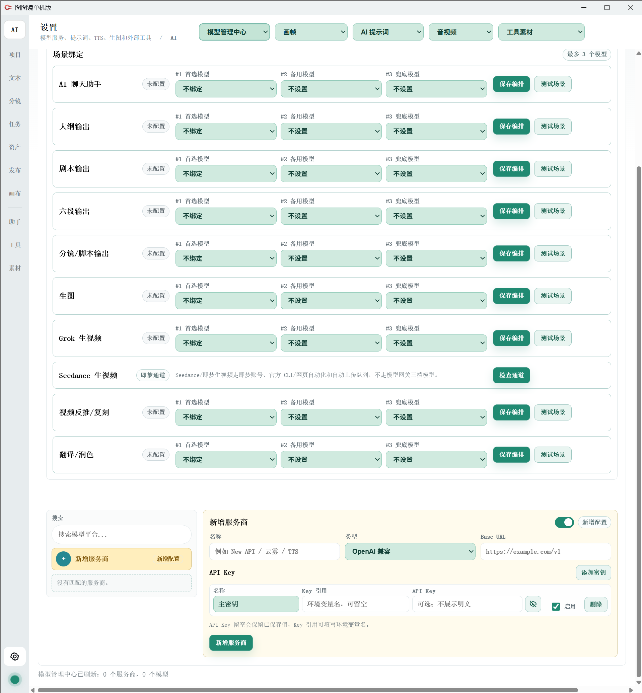
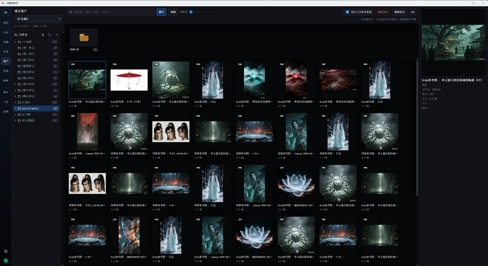
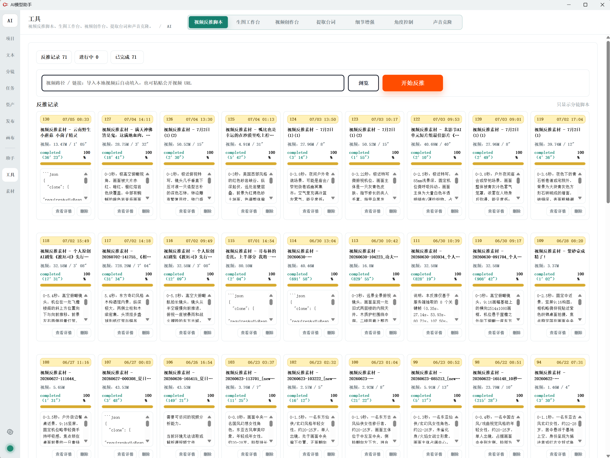

# 图图镜单机版

图图镜单机版是一款面向短剧、漫剧和视频创作的 Windows 本地工作台。它把项目管理、文本创作、分镜拆解、AI 助手、素材管理和模型 API 配置放在一个软件里，适合个人创作者在本机完成从剧本到分镜、素材整理和视频提示词的生产流程。

## 下载与启动

1. 打开右侧或顶部的 **Releases**。
2. 下载最新版本附件：`tutujing-standalone-v3.7.25-win-x64.zip`。
3. 解压后进入 `图图镜单机版` 文件夹。
4. 双击 `图图镜单机版.exe` 启动。

首次打开时，如果 Windows 出现安全提醒，选择“更多信息”后继续运行即可。不要直接在压缩包里双击运行，先完整解压。

## 基本使用流程

### 1. 新建项目

在 **项目** 页面点击 **新建项目**，填写项目名称，选择画面风格和视频比例。项目建立后，可以在左侧导航进入文本、分镜、任务、资产、发布、画布、助手、工具和素材等工作区。

项目首页适合管理不同作品，也可以按风格、比例和关键词快速筛选。

### 2. 写大纲、剧本、六段和脚本

进入 **文本** 页面后，可以在大纲、剧本、六段、脚本和分镜之间切换。你可以粘贴原文、小说、已有剧本或短梗概，然后用 AI 助手整理成大纲，再继续拆成剧本、六段和视频脚本。

剧本编辑区支持正文排版、标题层级、查找、保存和右侧 AI 对话。适合一边编辑正文，一边让助手补写、改写或检查连续性。

### 3. 使用 AI 助手

进入 **助手** 页面后，可以选择不同类型的助手，把当前内容交给助手处理。常见用途包括：

- 大纲整理
- 剧本改写
- 六段拆解
- 15 秒脚本生成
- 分镜提示词
- 角色、场景和道具梳理
- 视频反推和素材改写

### 4. 配置模型 API

第一次使用 AI 生成功能前，需要配置你自己的模型服务。

进入左下角 **设置**，打开 **模型管理中心**：

1. 在“新增服务商”里填写服务名称。
2. 选择服务类型，例如 OpenAI 兼容接口。
3. 填写 Base URL。
4. 填写 API Key，或填写本机环境变量名。
5. 保存服务商后，在上方“场景绑定”里给聊天、大纲、剧本、生图、生视频等场景选择模型。
6. 点“测试场景”确认接口可用。

说明：单机版不需要登录软件账号，但调用 AI 模型、生图或生视频时，需要你自己准备可用的模型 API 或本机模型服务。

### 5. 管理资产和素材

**资产** 页面用于管理项目里的图片、视频和文件夹素材。适合存放角色图、场景图、道具图、参考图和生成结果。

**工具** 视频反推是把经典视频片段进行反推成提示词，按秒拆解脚本，并且可以根据系统提示词进行脚本改编。生图、生视频、处理电商图片。声音克隆是根据已有的经典声音或者录音，把台词进行音色克隆。

### 6. 分镜和生视频

进入 **分镜** 页面后，可以按集、段、镜头整理角色、场景、道具和镜头内容。分镜可以继续用于故事图、图片生成和视频生成。

### 7. 帧镜 / 画布

左侧 **画布** 入口连接包内的帧镜模块，用于更自由地组织画布、素材和创作节点。

如果软件里打开画布时没有连接成功：

1. 打开软件目录里的 `帧镜` 文件夹。
2. 双击运行 `run.bat`。
3. 等窗口提示服务启动后，再回到软件里打开 **画布**。

## 数据保存位置

单机版的数据保存在软件目录下的 `Data` 文件夹。你的项目、设置、日志和本机服务数据都跟随这个文件夹。

需要迁移到另一台电脑时，可以把整个 `图图镜单机版` 文件夹一起复制过去。

## 常见问题

**双击没有反应怎么办？**  
先确认已经完整解压，不要在 zip 压缩包里直接运行。也可以右键 `图图镜单机版.exe`，选择“以管理员身份运行”。

**为什么 AI 生成不能用？**  
先到 **设置 - 模型管理中心** 配置模型 API，并用“测试场景”确认接口可用。

**单机版需要登录吗？**  
不需要登录软件账号。你只需要配置自己要使用的模型 API。

**画布打不开怎么办？**  
先运行 `帧镜\run.bat`，再回到软件里打开 **画布**。

**我的数据在哪里？**  
在软件同级的 `Data` 文件夹。不要删除这个文件夹。

QQ交流群：1049427612

